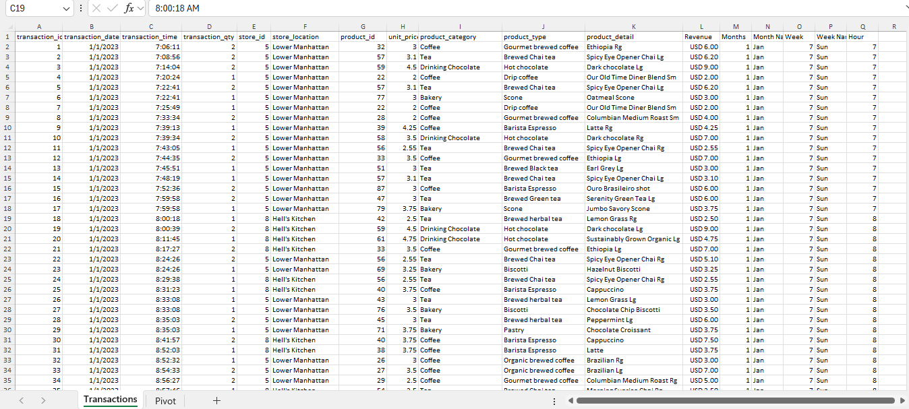
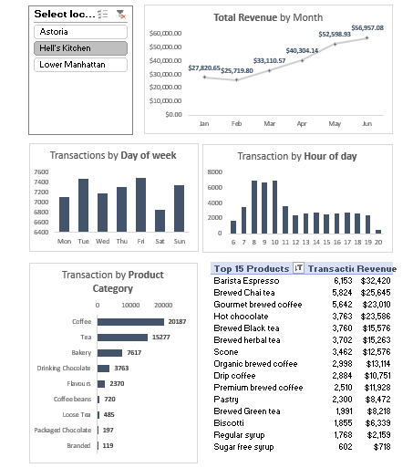

# Coffee Sales Dashboard

## Project Overview
Analyzed coffee sales across Astoria, Hell’s Kitchen, and Lower Manhattan to provide insights on revenue, transactions, and product performance.

## Features
- Interactive slicers for regions
- Total revenue by month
- Transactions by day of week and hour
- Sales by product category
- Top 15 products visualization

## Impact
- Enabled data-driven decisions for inventory and staffing
- Identified peak sales periods and high-performing products
- Improved regional sales visibility for targeted promotions

## Tech Stack
-  Excel (Pivot Tables, Charts, Slicers)
- Dashboard Visualization

## Data Preview

## Dashboard Preview

